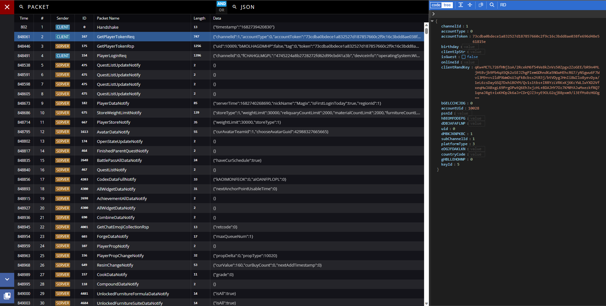
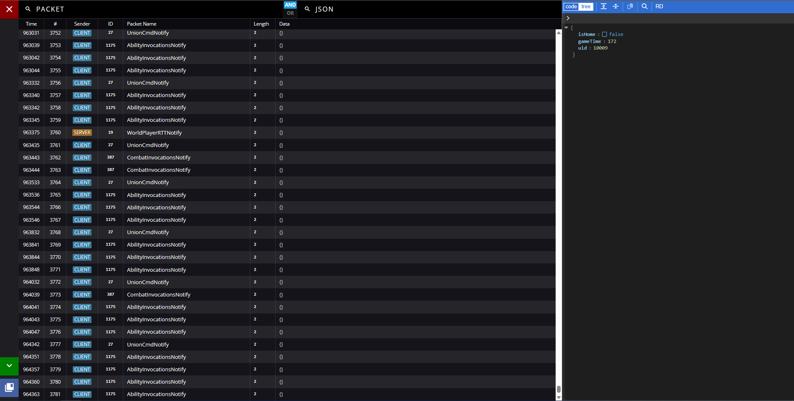

# Grasscutter-Packets
Visualize packets sent and processed by Grasscutter in your browser.\
**As of `395f7bad`, this plugin only supports the `unstable` branch of Grasscutter.**

**This project uses [Crepe-Inc/Iridium](https://github.com/Crepe-Inc/Iridium) to visualize packets.**\
Find the forked version of the frontend at [KingRainbow44/Packet-Visualizer](https://github.com/KingRainbow44/Packet-Visualizer).

# Usage
- Navigate to [/packets/viewer](https://localhost:443/packets/viewer/) in your browser
- Use `/packets` in-game or in the server console
- Configure packet logging in the `config.json` file

## Installation
1. Clone the repository
2. Build the project artifact (use IntelliJ IDEA)
3. Install the plugin JAR in a Grasscutter installation
4. Start Grasscutter and navigate to [/packets/viewer](https://localhost:443/packets/viewer/)

## Configuration
- `serveClient` - This will serve [the packet visualizer](https://github.com/KingRainbow44/Packet-Visualizer) on `/packets/viewer`.
  - This requires the server's dispatch/HTTP server to be enabled.
- `ignoredPackets` - A list of ignored packet names which won't be logged.
  - This is overridden by `highlightedPackets` if enabled.
- `highlightedPackets` - A list of packet names which will exclusively be logged.
  - This feature is turned off if there are no packet names set.
  - This overrides `ignoredPackets` if enabled.

## Command
The base command `/packets` has the following subcommands:
- `reload`, `reset` - This will reload the configuration file.
- `ignore`, `i` - This will add a packet name to the ignored packets list.
  - This subcommand requires an argument.
  - You can provide either a valid packet name (case-sensitive) or a packet ID.
- `unignore`, `ui` - This will remove a packet name from the ignored packets list.
  - This subcommand requires an argument.
  - You can provide either a valid packet name (case-sensitive) or a packet ID.
- `highlight`, `h` - This will add a packet name to the highlighted packets list.
  - This subcommand requires an argument.
  - You can provide either a valid packet name (case-sensitive) or a packet ID.
- `unhighlight`, `uh` - This will remove a packet name from the highlighted packets list.
  - This subcommand requires an argument.
  - You can provide either a valid packet name (case-sensitive) or a packet ID.

**NOTE:** All commands (besides `reload` and `reset`) will modify the configuration in memory.\
You can use `/packets reload` or `/packets reset` to revert the changes.

# Screenshots
*Initial login with `GetPlayerTokenReq` selected.*

*'Sticky' mode enabled with `PlayerGameTimeNotify` selected.*

